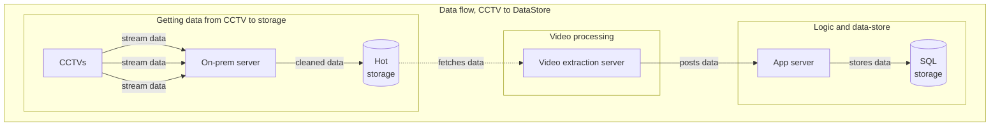
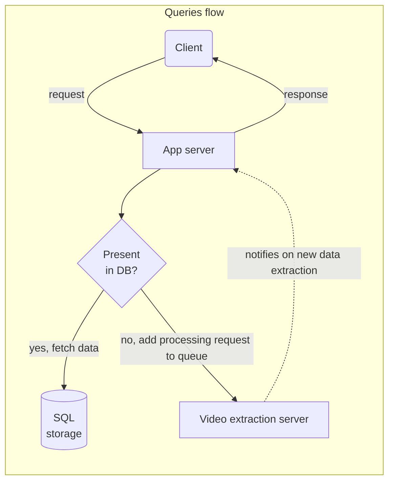
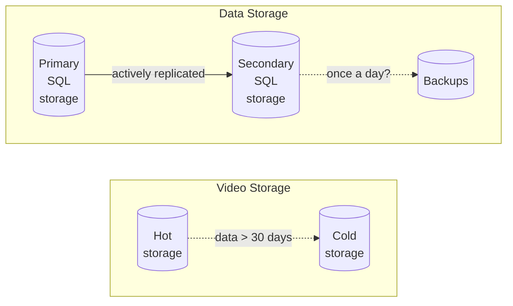

_Mall tracking_ 🛒
# Design overview
A summary; details and discussions follow.  

_Data flow, CCTV to DataStore:_

_Query flow:_  

_Storage details:_  

-----

# Requirements
## What are we trying to do?
We have a mall with a mesh of CCTVs. We want to track the path people take through the mall. We should be able to specify _filters_ for the characteristics of people whose path data we want to get. Eg: People wearing blue shirts.

## Our assumptions for the system
- Data processing does not happen in real time
- Queries for the data of the last 30 days are allowed

## What kind of queries do we get?  
Some sample queries we might get:[^queries]  
- Path of people wearing blue shirts
- Path of people wearing shoes
- Average distance covered by people

-----
# Workflows
**Population and extraction flow:**    
CCTVs have video data. Video is somehow converted into raw data that we can process.  
This raw data is then transformed into something we can query.  
**User querying flow:**  
When we get a query, we try to use the transformed data. If the transformed data does not have the datapoints we need, we trigger the video -> raw data -> transformed data again.  

# Component discussions
Based on this, we can split it into these sections:  
1. Fetching and storing data from CCTV
1. Processing videos to get raw data
1. Transforming and loading raw data to a data store
1. Getting queries from the user
1. Resolving queries with data from the data store

_(todo)_ Incidental features/nice to haves:
- History and results of past queries
- Metrics (data ingestion, queries processed etc)
- Scheduled reports

## Fetching and storing data from CCTV
**1. How much video do we have?**  
Factors: Number of CCTVs (1000), retention period (30 days + 30 days backup), quality (HD, 1080p).  
Storage needed for 60 days[^worst-case]: `1.2GB (1 hour HD video) * 1000 CCTVs * 24 hours * 60 days` = `1728TB`.

**2. Where do we store videos?**  
For data of the first 30 days, store it in warm storage like S3. For data of the next 30 days, store it in cold storage with expected infrequent access like Glacier (S3 costs >4x more than Glacier!).

**3. How do we get data from CCTVs to the data store?**  
Bandwidth needed per second: `1.2GB (per hour) * 1000 CCTVs / 60` = `20GB/s`.  
An on-prem server is needed to reliably take data from the CCTVs and upload it to the data store.  

### Conclusion:
- An on-prem server is present in the mall to reliably upload video data to our data store.  
- We have warm storage for 30 days of video data and cold storage for the next 30 days.

_Scope for optimization: We can move some of the basic processing from our processing load to this on-prem server; will reduce the size of data sent and load of the system.[^amzn-store]_

-----

## Processing videos to get raw data
In this context, raw data is the output from the ML model. Maybe we need to do some extra processing to make it usable, split it into floor sections etc later.  

1. **What is the scale of this data, how expensive is the processing?**  
Scale is 28tb/day; processing depends on the application, but from a structural pov looks like it would take a few servers - the equivalent of EC2 instances.[^ec2-for-ml]

**2. What does the raw data look like?**
A unique identifier, a list of co-ordinates, attributes, timestamps - all of this in any format.  

**3. When is data purged?**  
A cron job/scheduler can be set up to move data from warm storage to cold storage everyday.

### Conclusion:
We have a few servers that process video data and convert it into raw data, and a cron job that runs to move data to cold storage past the 30 day mark.

-----

## Transforming and loading raw data to a data store
**What does the data in the data store look like?**
Data needed:  
- Unique identifier, say `UUID`
- Location identifiers
    - Like GeoJSON[^geo-json] points: `{"type": "Point", "coordinates": [100.0, 0.0]}`
    - Or like SRIDs (spatial reference identifiers) - PostGIS[^postgis-points] points: `POINT(100.0, 0.0)`
- Timestamps with tz
- Attributes - key value pairs (`shirt: blue, shoes: yes`)

**What is the scale of this data?**    
Basic assumptions[^size-refs]:  
Let's say there are on average 10 attributes, each of those 16 bytes = 160 bytes.  
Each person is tracked every 30 seconds and there are 10,000 people per hour.  

| Data | Calculation | Total |
| ---- | ----------- | ----- |
|Size per entry|`UUID` (16 bytes) + `GeoJSON` (16 bytes) + `timestamp` (8 bytes) + `attributes` (160 bytes)|`200` bytes|
|Num of entries per person per day|`2 per minute * 60 minutes * 24 hours`|`2880 entries/day`|
|Size per day|`200 bytes * 2880 entries/person * 24,000 people/day` = `13,824,000,000 bytes`|`13.8GB`|
|Size per month|`13.8GB * 30 days`|`414GB`|

Optimization - the timestamp and location changes every 30s but attributes remain the same for a user. We can store this data separately and then map by UUID.  

| Data | Calculation | Total |
| ---- | ----------- | ----- |
|Size per location entry| `UUID` (16 bytes) + `GeoJSON` (16 bytes) + `timestamp` (8 bytes)|`40` bytes|
|Size per attributes entry|`UUID` (16 bytes) + `attributes` (160 bytes)|`176` bytes|
|Size for location entry per day|`40 bytes * 2880 entries/person * 24,000 people/day` = `2,764,800,000 bytes`|`2.7GB`|
|Size for attributes entry per day|`176 bytes * 24,000 people/day` = `4,224,000 bytes`|`4.2MB`|
|Total size per month|`2.7GB * 30 days` + `4.2MB * 30 days`|`81GB`|

So total size per month = `81GB`. For the design, let's say **`150GB` per month**.

### The data store
**Segregations of data:**  
1. Person locations (structured)
2. Person attributes (unstructured)

**Characteristics of our data store:**
|Characteristic|Suitable DB|
|---|:---:|    
|There's unstructured data|NoSQL|
|Load is within single server limits. Scalability at the cost of consistency is not required.|SQL|
|Repopulated frequently (whenever parameters change)|NoSQL generally, but only the unstructured part(attributes, `4.2MB/day`) is updated, so SQL|

Overall, SQL seems like a good fit, considering that performance in SQL is comparable to NoSQL[^geo-spatial-benchmark] and the volume of relational data is more than the unstructured data. Avoids table bloat as well. Let's say PostgreSQL.  

**General disadvantages of SQL and mitigations:**  
- Degradation of performance with large data: Proper indexes and partitioning by month. Our queries are also narrow in scope.
- Fixed schema: We can use a JSONB or HSTORE column to simulate unstructured NoSQL.
- Lack of horizontal scalabalility: Our load doesn't warrant this, so this is not a problem.

> **What if this is the wrong choice?** Ideally benchmarks should be done with expected data to find the optimal fit. However, migration is relatively simple considering we need to retain data for a short period and it's a single server - which means we're free to experiment and switch without downtime at any point in the future.

### The data model
What we need to store: Locations, attributes. Apart from that, we could also divide floors into sections (can reduce query spans and give us a good enough approximation).  

Core tables:  
Table `person`: `uuid`  
Table `person_location`: `uuid`, `location`, `timestamp`  
Table `person_attributes`: `uuid`, `attributes` (jsonb/hstore[^pg-nosql-sample])  

For optimized queries depending on usage and perf:  
Eg: for "how many people were exactly next to the door at 5pm?" we'd have to get the coordinates of the door and then query for people in that area.  
Table `grid`: `grid_id`, `floor`, `location` (bounding polygon of coordinates)  
Table `person_grid`: `uuid`, `grid_id`, `timestamp` (this is computed by the application. Same as `person_location` but with a different granularity)  
Utility table for "how many people were in the food court at 5pm?":  
Table `section`: `section_id`, `section_name`  
Table `section_grid`: `section_id`, `grid_id`  

**Optimizations:** Beyond this, materialized views are used for any frequently queried data or aggregates. Indexing and tuning is done for any frequently queried columns based on usage[^sample-indexing].  

### Conclusion:
An SQL DB with NoSQL support can be used for the DB.  
Sample workflow: "Path of people wearing blue shirts:"  
1. Get UUIDs of people with blue shirts from `person_attributes` table (NoSQL query part)  
1. Get locations of these UUIDs from `person_location` table (SQL query part)

**HA and Load balancing:**  
We can use active-passive replication for HA and use the passive replica for reads giving us backup and a higher throughput.  

**DR:**  
Store backups in another infrastructure at intervals that reflects how important the data is. Backups can be taken from the passive replica so as to not interfere with primary reads/writes.    

**Partitioning:**
Table is partitioned off by month; maintains a consistent size and is easier to purge (performant bulk deletes).  
- Every month, data older than 30 days is partitioned off to a separate table.
- Every month, partitions older than 60 days are deleted.

-----

## Resolving queries with data from the data store
Workflow: Console to input queries -> Application -> DB  

### Application
- Takes care of permissioning and IAM
- Has a DB of queries for users' use-cases. No raw SQL queries allowed.
- Maintains audit logs
- Checks health of DBs, processes metrics to decide if optimizations are needed
- Maintains a cache of the most frequently used user path data
- Transforms data into the format needed by users - `csv` for spreadsheets, visualizations like charts or dashboards etc

**All application design should be intentionally data and client agnostic.**  
ie., `apiHandler -> businessLogic -> dataStore` implies the businessLogic calls the underlying implementation (like S3 APIs).  
Should be `apiHandler -> presentationLayer -> businessLogic -> dataLayer -> dataStore` where businessLogic uses the Layers as an interface between underlying implementations.  
Makes it easier to make better tech and business decisions (add new caches where needed, add stubs for tests, switch out DBs etc).  

**What happens when data not present in the data store is requested?**  
- The video ML analyis is triggered again with the required parameters; all new parameters are reviewed 
- Triggers a repopulation of the `person_attributes` table, but all location data is untouched
- A sanity check should be in place to randomly diff older and newer attributes. Can be used to reject new data or trigger a human review.

# Footnotes
[^queries]: _Depends on business requirements (the answer to "why do we need this data?"). Will make some assumptions for now._  
[^worst-case]: _Assuming all CCTVs are recording 24 hours a day. Practically we might have off hours where analytics isn't needed._  
[^ec2-for-ml]: _[Amazon's ML infrastructure recommmendation](https://aws.amazon.com/machine-learning/infrastructure-innovation), a bunch of EC2 instances._  
[^geo-json]: _[GeoJSON wiki](https://en.wikipedia.org/wiki/GeoJSON)_  
[^postgis-points]: [PostGIS geometries](https://postgis.net/workshops/postgis-intro/geometries.html)  
[^size-refs]: _Size assumptions are made from [PostgreSQL data types](https://www.postgresql.org/docs/9.1/datatype.html)_  
[^amzn-store]: _The [Amazon Store](https://towardsdatascience.com/how-the-amazon-go-store-works-a-deep-dive-3fde9d9939e9) structure does something similar with extra compute on-prem to cut down on bandwidth requirements_
[^geo-spatial-benchmark]: _[Benchmark paper](https://link.springer.com/article/10.1007/s10707-020-00407-w) for SQL vs NoSQL - performance is comparable_  
[^pg-nosql-sample]: _Quick overview of the NoSQL datatypes - [hstore, jsonb (binary) and json](https://www.linode.com/blog/databases/harnessing-nosql/)_  
[^sample-indexing]: _PostgreSQL scales to millions of rows and has table size limits in TBs. We could figure out optimizations [like clustered indices](https://stackoverflow.com/a/35541546) to improve perf later._  
